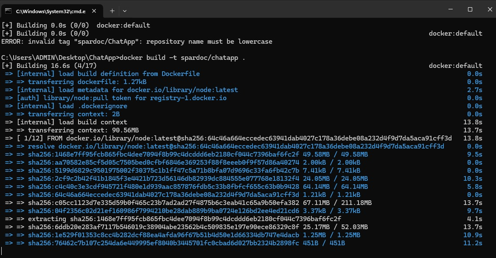

PRUEBA 1 Por Samuel Pardo

Cómo construir la imagen:

Para construir la imagen de Docker para esta aplicación de chat, navegue al directorio donde se encuentra el Dockerfile y ejecute el siguiente comando en la terminal:

```bash 
docker build -t nombre-de-tu-imagen .
```


Reemplace nombre-de-tu-imagen con el nombre que desea asignar a la imagen de Docker.

Cómo ejecutar la aplicación

Una vez construida la imagen, puede ejecutar la aplicación utilizando el siguiente comando:

```bash 
docker run -d -p 3000:3000 -p 80:80 --name nombre-del-contenedor nombre-de-tu-imagen
```

Reemplace nombre-del-contenedor con el nombre que desea asignar al contenedor y nombre-de-tu-imagen con el nombre de la imagen que construyó previamente. Este comando inicia el contenedor en modo 'detached', mapea los puertos necesarios para acceder al servidor Node.js y al frontend Angular, y ejecuta ambos servicios dentro del contenedor.

